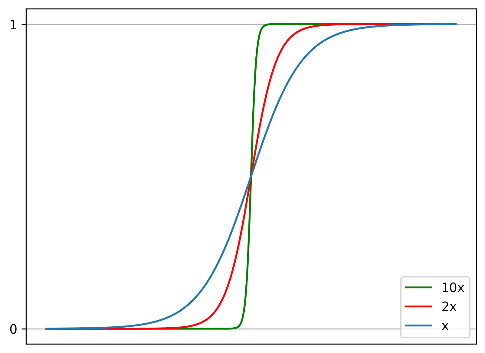

A classification problem is designed to return a prediction which is one
of a finite number of labels, rather than some real value.

```python
import matplotlib as mpl
import matplotlib.pyplot as plt
from matplotlib.ticker import (MultipleLocator, AutoMinorLocator, FormatStrFormatter)
import numpy as np
import sklearn.datasets
import math
%matplotlib inline

def new_plot():
    fig = plt.figure(dpi=300)
    ax = fig.add_subplot(1,1,1)
    ax.set_xticks([])
    ax.set_yticks([])
    ax.set_aspect('auto')
    return fig, ax
```

## Linear Separator

Linear functions can perform classification. Such a function is called
the _decision boundary_ or _linear separator_. A data set admitting a
linear separator is considered _linearly separable_ and there exists a
solution to the function $h$ with zero cost.

In classification, the hypothesis $h_{\mathbf{w}}(\mathbf{x})$ is the
linear function $\mathbf{w}\cdot\mathbf{x}$ passed through a _threshold
function_, returning the classification of the input, rather than a real
value, as in regression. If the data set is linearly separable, the
_percepton learning rule_ will converge on an exact solution.

$$w_i \leftarrow w_i - \alpha (h_{\mathbf{w}}(\mathbf{x}) - y_j) \times x_{i}$$

## Sigmoid Function

The _sigmoid_ or _logistic_ function returns a value in the interval
$(0,1)$, representing the probability that the point has the
classification 1. In logistic regression, the vector product of the
weights and inputs is passed through this logistic function. This
function is differentiable at all points and it is continuous in its
input. The logistic function is a _softer_ threshold function.

$$\sigma(u) = \dfrac{1}{1+e^{-u}}$$

$$h_{\mathbf{w}}(\mathbf{x}) = \dfrac{1}{1+e^{-\mathbf{w}^T\mathbf{x}}}$$

$$\sigma(\mathbf{w}^T\mathbf{x}) = P(y=1|\mathbf{w},\mathbf{x})$$

The sigmoid function, in code:

```python
def sigmoid(u):
    return 1 / (1+math.e ** -u)
```

The sigmoid function, visualised:

```python
x = np.linspace(-8, 8, 1000)
f, ax = new_plot()
ax.set_xticks([])
ax.yaxis.set_major_locator(MultipleLocator(1))
ax.grid()
ax.plot(x, sigmoid(10 * x), 'green', label="10x")
ax.plot(x, sigmoid(2 * x), 'red', label="2x")
ax.plot(x, sigmoid(x), label="x")
ax.legend(loc='lower right')
```



## Cost Function

Square loss remains a suitable cost function, but as the logistic
function always returns a value between 0 and 1, _cross-entropy_ cost is
preferred.

$$
L(\mathbf{w}) = \begin{cases} - \log(h*{\mathbf{w}}(\mathbf{x})), &
\text{if } y = 1 \\ - \log(1-h*{\mathbf{w}}(\mathbf{x})), & \text{if } y
= 0 \end{cases}
$$

This can be expressed in a single expression as:

$$
L(\mathbf{w}) = -(y\log(h*{\mathbf{w}}(\mathbf{x})) +
(1-y)\log(1-h*{\mathbf{w}}(\mathbf{x})))
$$

The average cost over many examples:

$$g(\mathbf{w}) = -\frac{1}{N}\sum_n^N (y_{n}\log(h_{\mathbf{w}}(\mathbf{x}_n)) + (1-y_n)\log(1-h_{\mathbf{w}}(\mathbf{x}_n)))$$

The derivative of the cross-entropy cost function:

$$\nabla g(\mathbf{w}) = -\frac{1}{N}\sum_n^N (y_{n} - h_{\mathbf{w}}(\mathbf{x}_n)\times \mathbf{x}_n$$

The weight update rule:
$$\mathbf{w}_i \leftarrow \mathbf{w}_i + \alpha\sum_n^N (y_{n} - h_{\mathbf{w}}(\mathbf{x}_n)\times \mathbf{x}_{n,i}$$

With theses expressions, it is possible to perform _logistic
regression_, and update the weights of the underlying function to redraw
the decision boundary.

```python
def create_minibatches(a, m):
    n = int(x.shape[0] / m)
    return np.array_split(a[:m * n], n), n

def h(W, X):
    return sigmoid(sum(W * X))


def logistic_regression(a, m, W, y, X):
    X = np.concatenate((np.ones((X.shape[0],1), dtype=int), X), axis=1)
    X, n = create_minibatches(X, m)
    y, n = create_minibatches(y, m)
    for b in range(n):
        for w in range(W.size):
            W[w] += a * sum([((h(W, X[b][x])) - y[b][x]) * X[b][x][w] for x in range(X[b].shape[0])])
    return W
```

In this example, the points are labelled in advanced (logistic
regression is always a supervised problem). The decision boundary is
drawn between the two classes. Note that this problem is not
linearly separable - the cost on the training set is not 0 - it is
however a fairly good predictor.

```python
X, y = sklearn.datasets.make_classification(n_samples=200,
                                            n_features=2,
                                            n_redundant=0,
                                            n_informative=1,
                                            n_clusters_per_class=1)
W = np.array([0.,0.,0.])
for _ in range(10):
    W = logistic_regression(0.001, 10, W, y, X)

f, ax = new_plot()
colors = ["blue", "red"]
ax.scatter(X[:, 0], X[:, 1],
           marker=".", c=y, s=1,
           cmap=mpl.colors.ListedColormap(colors))
ax.plot(X[:, 0],
        [X[i, 0] * (W[1] / (-1 * W[2]))
                  + W[0] for i in range(X.shape[0])],
        'green')
```


