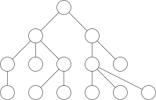
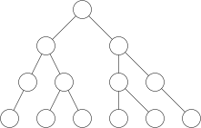

A tree data structure models the abstract tree type. A conceptual tree
is a hierarchical structure with an explicit *root*. In the context of
data structures and algorithms, a tree is a type of connected graph,
composed of *nodes* and *edges* with no cycles and exactly one route
between the root and any other node. Trees are generally depicted with
the root node at the top and all other nodes arranged into discrete
levels as in figure [fig:general\_tree](fig:general_tree).

A tree is composed of *nodes* which contain data and references to other
connected nodes. A node in a tree may have any number of connected
*child* nodes. Every tree node is referenced by exactly one *parent*
node, except in the case of the root node which does not have a parent
node. Each node can be treated as the root of its own sub-tree. The
sub-tree with any tree node as its root has all the same properties as
the tree the sub-tree root belongs to.

-   A *descendant* of a node is any node that can be reached traversing
    from parent to child, repeatedly if necessary. A node can have as
    many or more descendants than children.
-   An *ancestor* of a node is any node that can be reached by
    traversing from child to parent any number of times (at least once).
    A non-root node always has exactly one parent, but may have many
    nodes as ancestors.
-   A *path* is a sequence of connected edges between two nodes via any
    number of other nodes.
-   The *depth* or *level* of a node in a tree is the length of the path
    from the root to the node. The root node has a depth of 0.
-   A node is considered *internal* if it has one or more connected
    children.
-   A node is said to be a *leaf* node if it has exactly zero connected
    children.
-   A node\'s *siblings* are any nodes with the same parent. It is
    possible for a node to have no siblings.

The *height* of a tree is the length of the longest path from the root
to any node, *ie.* the maximum depth of any node. The *size* of a tree
is the number of nodes it contains. An empty tree has 0 nodes and so a
size of 0 and in conventional notation a height of -1.

Inductive Type Definition
-------------------------

Each node in a tree is the root of a sub-tree rooted at that point. A
tree can be built *inductively* from the special *empty tree* which has
no value and no children. Larger trees are built with a value and a list
of children, a list of trees is called a *forest* $F$. For a general
tree, the ADT can be defined:

-   $\text{emptytree}() \rightarrow T$
-   $\text{maketree}(E,F) \rightarrow T$
-   $\text{isemptytree}(T) \rightarrow \top|\bot$
-   $\text{children}(T \rightarrow F)$
-   $\text{valuetree}(T \rightarrow E)$

A common implementation of the general tree with no constraint on the
number of children of each node is the *sibling list*, illustrated in
figure [fig:sibling\_list](fig:sibling_list). Each node has in addition
to its value, a pointer to the list of its children and a second pointer
to its next sibling.

Binary Trees
------------

A *binary tree* is a type of *N*-ary tree in which each node has at most
two children as in figure [fig:binary\_tree](fig:binary_tree). The
general tree definition holds for binary trees, but the binary nature of
the tree is not enforced. A proper binary tree definition states that
building a new tree requires two child trees rather than a list of trees
of unspecified length. Similarly, a binary tree node\'s children are
returned by two specific accessor:

-   $\text{emptybinarytree}() \rightarrow T$
-   $\text{makebinarytree}(E,T,T) \rightarrow T$
-   $\text{isemptybinarytree}(T) \rightarrow \top|\bot$
-   $\text{leftbinarytree}(T) \rightarrow T$
-   $\text{rightbinarytree}(T) \rightarrow T$
-   $\text{valuebinarytree}(T) \rightarrow E$

A binary tree or any *N*-ary tree can be implemented as a sibling list,
but this is usually unnecessary if the maximum number of children is
know. Without changing how a node is defined, the first pointer can be
used to point to the left child and the second pointer can be used to
point to the right child rather than the list of children and the next
sibling, as was the case before.

For fast access and traversal without repeated dereferencing, values can
be added to a position in an array. The children of each node are
accessed by index $2^i$ and $2^i+1$ where $i$ is the index of the
current node. To make the arithmetic work, the zeroth entry in the array
is left empty. This approach limits the maximum size of the tree, unless
the array is dynamic, and is wasteful if the leaves are found at
different levels.

Binary Search Trees
-------------------

A binary search tree is a type of binary tree with the additional
constraint that a node\'s children are in order; keys with a lower value
are inserted into the left and keys with higher values are inserted into
the right subtree. Any subtrees rooted on a node\'s left or right child
must also be binary search trees.

Keys are sorted as they are added so in-order traversal will give the
inserted keys in order. A binary search tree can be *flattened* into an
array by appending the flattened right subtree to the list containing
the flattened left subtree and the value of the root in that order
(recursively).

### Node Deletion

To delete a non-leaf node with only one subtree child, replace the node
to be deleted with the root of the subtree. If a node is a leaf node
(has no children) it can be removed in a single step (figure
[fig:bst\_delete\_0\_1\_children](fig:bst_delete_0_1_children)).
Otherwise, if a node $x$ to be deleted has two children (figure
[fig:bst\_delete\_2\_children](fig:bst_delete_2_children)):

-   Identify the leftmost node $y$ in the right subtree of $x$.
-   Replace the value of $x$ with the value of $y$.
-   Remove the node $y$ by replacing $y$ with its right child, if it
    exists.

### Verifying Binary Search Trees

There are many approaches to verify a tree is a binary search tree. The
most simple (but computationally complex) is to traverse the left
subtree and ensure all values are lower than the current node and then
traverse the right subtree, ensuring all values are larger than the
value of the root and then recursively check this is true of every
subtree. The same procedure can be achieved in one traversal by setting
lower and upper limits $l$ and $u$ to some special extreme value and
then, taking the root of the tree:

1.  If the current node is empty, return *true*.
2.  If the current node is not empty and is not in $(l, u)$ return
    *false*.
3.  Else:
    1.  Setting the current node\'s value as $u$ and using the existing
        value of $l$, check the left subtree is a binary search tree. If
        this is not true, return *false*.
    2.  Setting the current node\'s value as $l$ and using the existing
        value of $u$, check the right subtree is a binary search tree.
        If this is not true, return *false*.
    3.  Return *true*.

### Complexity

The *balance* at any node is the difference in height between left and
right subtrees. Insert and search operations on a search tree are faster
if the tree is balanced. Ideally, the median key is inserted first so
that roughly half the keys are inserted to the left and half to the
right, assuming the order of insertion is random. In the worst case,
keys are inserted roughly in order, making the tree resemble a unary
linked list. These two cases are compared in figure
[fig:bst\_cases](fig:bst_cases). Search, insert and delete on a binary
search tree with $n$ nodes are $O(\log n)$ in the average case and
$O(n)$ in the worst case.

