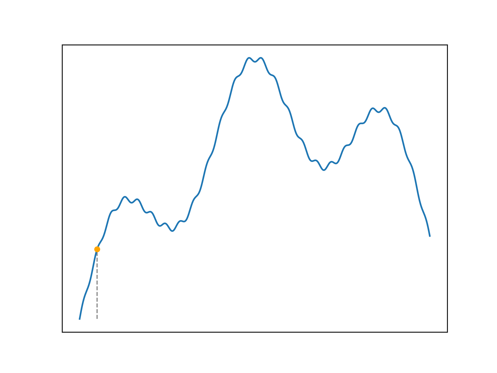

Optimisation problems search for the best (optimal) or a good solution
to a problem, satisfying constraints.

```python
import matplotlib as mpl
import matplotlib.pyplot as plt
import matplotlib.animation as animation
from matplotlib.ticker import (MultipleLocator, AutoMinorLocator, FormatStrFormatter)
import numpy as np
import sklearn.datasets
import math
import random
%matplotlib inline

def new_plot():
    fig = plt.figure(dpi=300)
    ax = fig.add_subplot(1,1,1)
    ax.set_xticks([])
    ax.set_yticks([])
    ax.set_aspect('auto')
    return fig, ax
```

## Hill Climbing

A very simple optimisation algorithm is hill climbing. The process
resembles generating neighbour solutions, which are close to the current
solution, and moving in the direction of the best neighbour. This
approach will rapidly converge on a nearby optima, however it is not
guaranteed to find the global maxima - it is sub-optimal. Hill climbing
is said to be _greedy_, it always takes the best quality neighbour at
every step, even if a better solution can be reached by temporarily
accepting a worse neighbour. The hill climbing implementation given here
is made complicated by the animation code (which is written poorly).

```python
def get_neighbours(x):
    return x + 1, x - 1


def init_hill_climbing():
    current = ax.scatter([], [], c='orange', zorder=5, s=100)
    equal = ax.scatter([], [], c='orange', zorder=5, s=100)
    better = ax.scatter([], [], c='green', zorder=5, s=100)
    worse = ax.scatter([], [], c='red', zorder=5, s=100)
    solution = ax.scatter([], [], c='green', zorder=5, s=100)
    converged = False
    return current, [better, equal, worse], solution, converged


def hill_climb(step):
    global converged
    global current_solution
    if step % 2 == 0:
        for plot in neighbour_plots:
            plot.set_visible(False)
        if converged:
            current_plot.set_visible(False)
            solution_plot.set_offsets([current_solution, f(current_solution)])
        else:
            current_plot.set_offsets([current_solution, f(current_solution)])
    else:
        local_neighbours = get_neighbours(current_solution)
        local_neighbour_solutions = [f(i) for i in local_neighbours]
        local_neighbour_quality = [[],[],[]]

        for i in range(2):
            if local_neighbour_solutions[i] > f(current_solution):
                local_neighbour_quality[0].append(local_neighbours[i])
            elif local_neighbour_solutions[i] == f(current_solution):
                local_neighbour_quality[1].append(local_neighbours[i])
            else:
                local_neighbour_quality[2].append(local_neighbours[i])

        for i in range(3):
            if len(local_neighbour_quality[i]) > 0:
                neighbour_plots[i].set_visible(True)
                neighbour_plots[i].set_offsets(np.stack([local_neighbour_quality[i],
                                                         f(np.array(local_neighbour_quality[i]))]).T)

        if max(local_neighbour_solutions) > f(current_solution):
            current_solution = local_neighbours[local_neighbour_solutions.index(max(local_neighbour_solutions))]
        else:
            converged = True
```

For functions with a single maxima, hill climbing finds the optimal
solution.

```python
def f(x):
    return -x**2


x = np.linspace(-5, 5, 1000)
fig, ax = new_plot()
ax.plot(x, f(x))

current_plot, neighbour_plots, solution_plot, converged = init_hill_climbing()
current_solution = -4

anim = animation.FuncAnimation(fig=fig, func=hill_climb, frames=11, interval=500)
anim.save('../animations/optimal.gif')
```

{#fig:optimalhillclimbing .nocaption}

Applied to more complicated problems, hill climbing may not find a
perfect solution as it can become _trapped_ in a local maxima. It is
unable to traverse the search space to find better solutions. Sometimes
this is not a problem, as a sub-optimal solution may be adequate.The
following examples illustrate this problem.

```python
def f(x):
    return (-x**4 - x**3 + 24*x**2)


x = np.linspace(-5, 5, 100)
fig, ax = new_plot()
ax.plot(x, f(x))

current_plot, neighbour_plots, solution_plot, converged = init_hill_climbing()
current_solution = 1

anim = animation.FuncAnimation(fig=fig, func=hill_climb, frames=7, interval=500)
anim.save('../animations/local_maxima.gif')
```

{#fig:sub-optimalhillclimbing .nocaption}

```python
def f(x):
    def _f(x):
        if x < 3:
            return x
        elif x < 6:
            return 3
        else:
            return -(x-8)**2+7

    return np.vectorize(_f)(x)

x = np.linspace(0, 10, 1000)
y = [f(x) for x in x]
fig, ax = new_plot()
ax.plot(x, y)

current_plot, neighbour_plots, solution_plot, converged = init_hill_climbing()
current_solution = 1

anim = animation.FuncAnimation(fig=fig, func=hill_climb, frames=7, interval=500)
anim.save('../animations/plateau.gif')
```

{#fig:plateau .nocaption}

## Simulated Annealing

Simulated annealing is one strategy to improve the performance of hill
climbing algorithms.

At each step, a random neighbour solution is generated. If this
candidate solution is better than the current one, it is immediately
selected. If the generated neighbour is worse, it is accepted with some
probability. This probability is inversely proportional to how bad this
neighbour is (less bad neighbours are more likely to be accepted). Over
time, this probability is decreased according to the _schedule_. This is
called the _annealing_ process.

Initially, the annealing algorithm is likely to accept a series of worse
neighbours, allowing it to escape a local maxima and traverse the search
space. The algorithm gradually forms a basis of attraction to
increasingly small sections of the search space which contain a maxima.

Because of the random nature of annealing, the algorithm is not optimal,
however the probability of locating the global maxima approaches 1 as
the annealing schedule is extended. Brute-force examination of the
search space may be faster than random annealing in some cases. Often,
the annealing approach is likely to improve upon a solution quickly, by
escaping several local optima.

```python
def update_temperature(T):
    return 0.999*T


def p_worse_neighbour(c, n, T):
    return math.e**((f(n) - f(c))/T)


def get_random_neighbour(x):
    if random.randint(0,1):
        return x + 4 if x + 4 < 160 else x - 4
    else:
        return x - 4 if x - 4 > 0 else x + 4


def simulated_annealing():
    global current_solution
    global T
    neighbour = get_random_neighbour(current_solution)
    if f(neighbour) <= f(current_solution):
        if p_worse_neighbour(current_solution, neighbour, T) > random.random():
            current_solution = neighbour
    else:
        current_solution = neighbour
    T = update_temperature(T)
```

Define the search space, the starting solution and the initial
temperature.

```python
def f(x):
    return 0.4*(2*math.sin(0.5*x) + 20*math.sin(0.1*x) + 80*math.sin(1/60*x))

x = np.linspace(0, 170, 1000)
current_solution = 12
T = 20
```

Put together an animation of the annealing process.

```python
fig, ax = new_plot()

ax.plot(x, np.vectorize(f)(x), zorder=2)
current = ax.scatter([], [], c='orange', zorder=3, s=20)
line, = ax.plot([], [], c='gray', ls='--', zorder=1, lw=1)

def animate_simulated_annealing(frame):
    global current_solution
    global T
    simulated_annealing()
    current.set_offsets([current_solution, f(current_solution)])
    line.set_xdata([current_solution, current_solution])
    line.set_ydata([0, f(current_solution)])

anim = animation.FuncAnimation(fig=fig,
                               func=animate_simulated_annealing,
                               frames=2000, interval=20)
anim.save('../animations/simulated_annealing.gif')
```

{#fig:simulated_annealing .nocaption}
