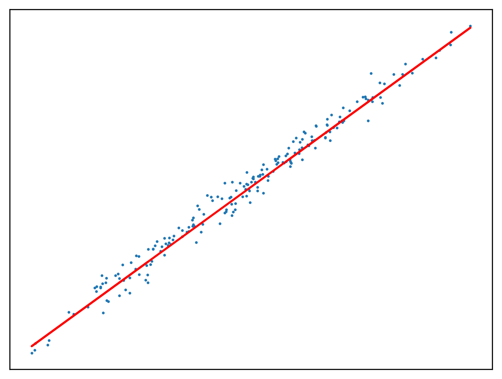
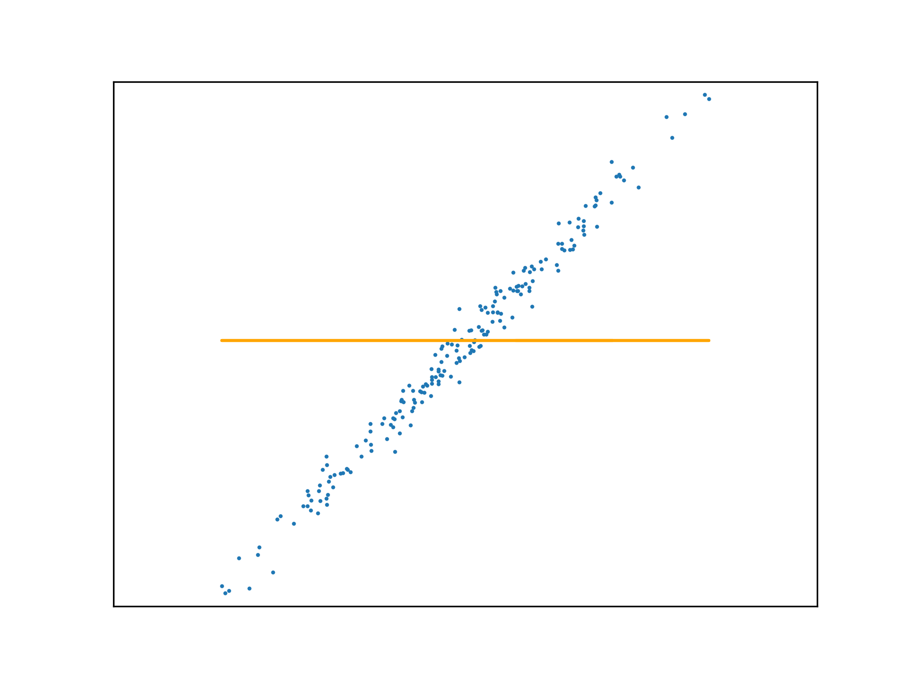
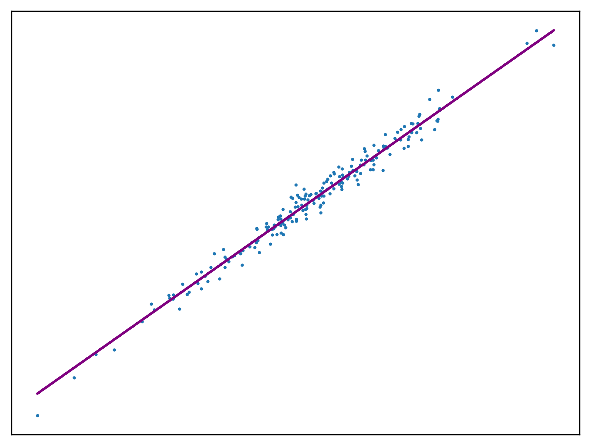
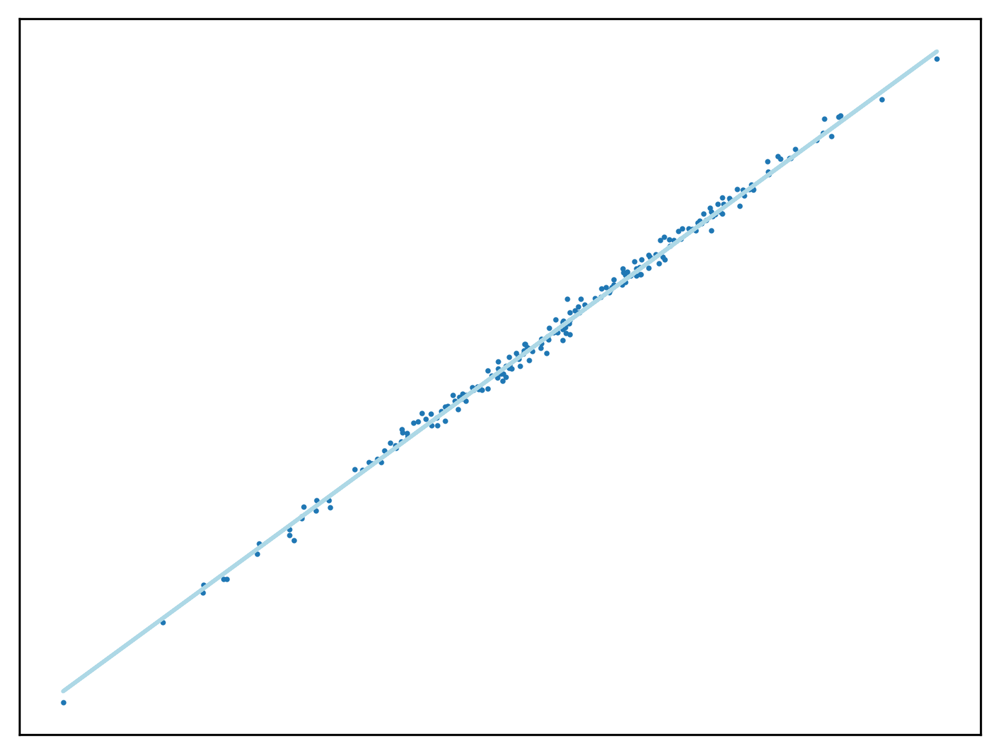
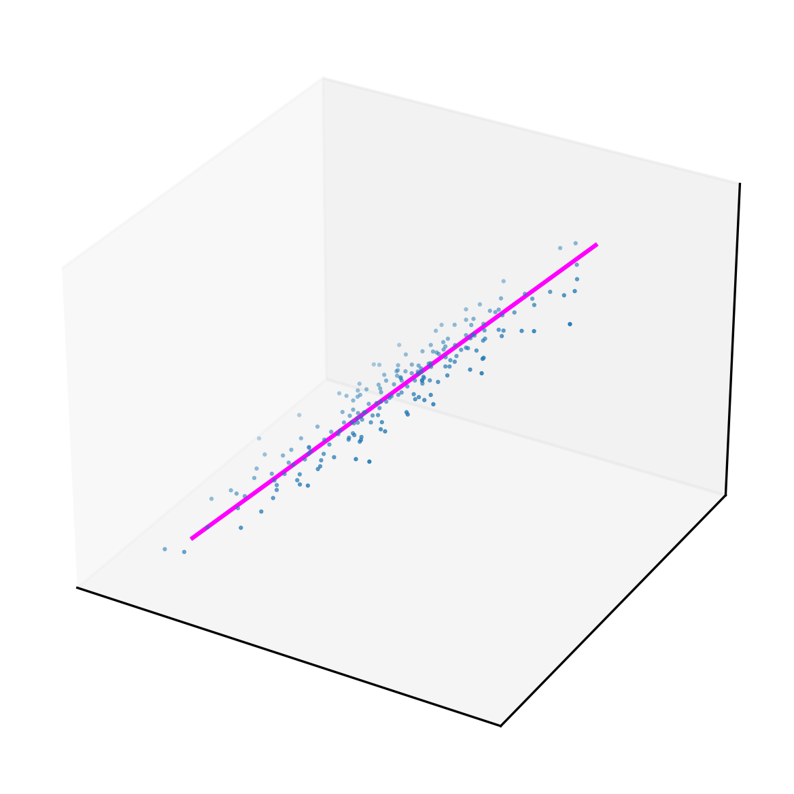
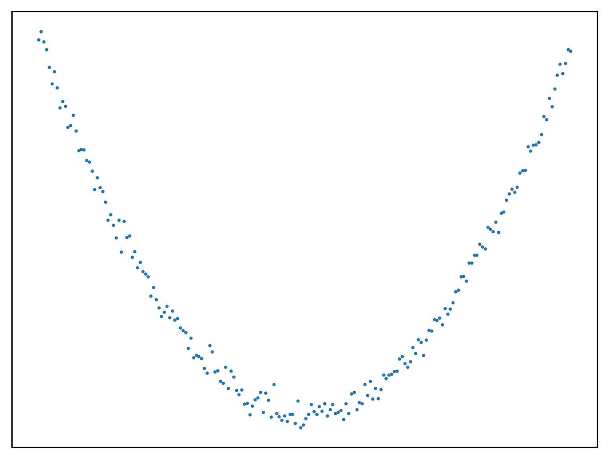

Regression applies to learning problems in which the output is real
valued and continuous (outputs do not fit into discrete categories).
First, import the required modules.

```python
import matplotlib as mpl
import matplotlib.pyplot as plt
import matplotlib.animation as animation
from matplotlib.ticker import (MultipleLocator, AutoMinorLocator, FormatStrFormatter)
import numpy as np
import sklearn.datasets
import math
%matplotlib inline
```

## Convenience Functions

Use the `make_regression` function of scikit learn to generate a sample
dataset with a single feature (see _univariate_ below). Return the
coefficient and recreate the linear function from which the dataset is
generated. Also wrap matplotlib OOP style API calls in a special
function that returns a set of axes with the preferred configuration.

```python
def uni_linear_regression_dataset():
    r = sklearn.datasets.make_regression(n_samples = 200,
                                         n_features = 1,
                                         noise=10.0,
                                         coef=True)
    return r[0].reshape(200,), r[1], r[2]

def f(w_1, x, w_0):
    return w_1 * x + w_0

def new_plot():
    fig = plt.figure(dpi=300)
    ax = fig.add_subplot(1,1,1)
    ax.set_xticks([])
    ax.set_yticks([])
    ax.set_aspect('auto')
    return fig, ax
```

## Univariable Linear Regression

The process of fitting a straight line to an $x$/$y$ dataset is called
_univariate linear regression_, univariate referring to the single output
variable $y$. In the most simple case, $x$ is a single value, though in
more complicated cases $\mathbf{x}$ is a vector of values, linear
regression applies to these cases equally well. Sometimes a function
with a vector of inputs is called _multivariable_ or even
_multivariate_, despite having just one dependent variable.

A simple linear function $h$ with one independent value is of the form
$y=mx+c$, or in data science $y=w_1x+w_0$. The vector $\mathbf{w}$ is
the vector of weights: $\langle w_0, w_1 \rangle$. The function of $x$
with weights $\mathbf{w}$ is:

$$h_{\mathbf{w}}=w_1x+w_0$$

The ambition with linear regression is to calculate the values of the
weights in $\mathbf{w}$ so that $h$ approximates the relationship
between $x$ and $y$, by minimising loss. First, create the regression
algorithm in the special case that $x$ is a single value, then
generalise to a _n_-dimensional vector.

### Loss Function

The loss for a single training example is a measure of how bad the
current model is. Mean square loss is appropriate as it always returns a
positive value.

$$g(w_0, w_1) = (h_{\mathbf{w}}(x) - y)^2$$

Average loss over many examples:

$$g(w_0, w_1) = \frac{1}{N}\sum_{n=1}^{N}(h_{\mathbf{w}}(x_n) - y_n)^2$$

These two functions, expressed in code:

```python
def _mse(y_pred, y_actual):
    return (y_pred - y_actual) ** 2

def mse(y_actual, y_pred):
    loss = 0.0
    for i in range(y_actual.size):
        loss += _mse(y_pred[i], y_actual[i])
    return loss/y_actual.size
```

Compare the cost for a fitted function (for which the parameters are
already know) with a line of gradient 1, for example. The fitted
function has a much smaller cost.

```python
x,y,m = uni_linear_regression_dataset()
print(mse(y, f(m, x, 0))) # small cost
print(mse(y, f(1, x, 0))) # large cost
```

    98.72505111720218
    4168.6452977282315

### Stochastic Gradient Descent

To perform regression, a function must be fitted to a dataset. For
univariate linear regression, the parameters can be computed exactly
from the derivative of the loss function, though a different approach is
required to fit more complex functions.

To this end, the weight space is traversed to find a suitable minimum by
repeatedly adjusting the weights for each element $x$ in the training
set, making a small step in the direction of steepest descent, according
to the _learning rate_ $\alpha$. If the loss represents how poor the
current model is on a training example, the learning process should
**minimise** this loss and hence the term _gradient descent_ is
preferred over hill-climbing.

Where $\mathbf{w}$ is the vector of weights as before, the gradient
descent algorithm updates each weight by taking the partial derivative
of the loss function $L$ with respect to that weight for each point
$x$.

$$w_i \leftarrow w_i - \alpha \frac{\delta}{\delta w_i}L(x)$$

```python
def SGD1(a, w_0, w_1, y, x):
    for i in range(x.size):
        w_0 -= (a * (f(w_1, x[i], w_0) - y[i]))
        w_1 -= (a * (f(w_1, x[i], w_0) - y[i]) * x[i])
    return w_0, w_1
```

Use this method to fit a function to a new regression problem:

```python
x,y,m = uni_linear_regression_dataset()
w_0 = w_1 = 0.0

w_0, w_1 = SGD1(0.1, w_0, w_1, y, x)

fig, ax = new_plot()
ax.scatter(x,y, s=1)
ax.plot(x, f(w_1, x, w_0), 'red')
```

{#fig:regression_11_1 .nocaption}

### Deterministic Gradient Descent

Adopting the stochastic approach to gradient descent, the function is
tuned after calculating the loss of each element in $x$. An _epoch_ is a
step that observes all training examples. In _deterministic_ gradient
descent, the total cost for a whole epoch is determined and used to make
a single adjustment to $\mathbf{w}$, again according to the learning
rate.

```python
def DGD1(a, w_0, w_1, y, x):
    w_0 -= (a * sum([f(w_1, x[i], w_0) - y[i] for i in range(x.size)]))
    w_1 -= (a * sum([(f(w_1, x[i], w_0) - y[i]) * x[i] for i in range(x.size)]))
    return w_0, w_1
```

Use this method to fit a function to a new regression problem, over a
number of epochs:

```python
x,y,m = uni_linear_regression_dataset()
w_0 = 0
w_1 = 0
fig, ax = new_plot()

def animate(epoch):
    global w_0
    global w_1
    global ax
    ax.clear()
    ax.set_xticks([])
    ax.set_yticks([])
    ax.set_xlim(np.min(x)-1,np.max(x)+1)
    ax.set_ylim(np.min(y)-10,np.max(y)+10)
    ax.scatter(x,y, s=1)
    if epoch > 0 and epoch < 23:
        w_0, w_1 = DGD1(0.001, w_0, w_1, y, x)
    if epoch < 23:
        ax.plot(x, f(w_1, x, w_0), 'orange')
    else:
        ax.plot(x, f(w_1, x, w_0), 'green')

anim = animation.FuncAnimation(fig=fig, func=animate, frames=25, interval=10)
anim.save('../animations/epochs.gif')
```

{#fig:animation .nocaption}

### Mini-batch Gradient Descent

The stochastic gradient descent algorithm seen before is a special case
of _mini-batch_ gradient descent. The loss of all the points within a
mini-batch within the training set are used to calculate a change to the
vector of weights. This is often preferred over both approaches seen so
far as it converges faster than element by element SGD, without the
resource utilisation of fully deterministic gradient descent.

```python
def SGD(a, n, w_0, w_1, y, x):
    x = x.reshape(-1, n)
    y = y.reshape(-1, n)
    for i in range(x.shape[0]):
        w_0 -= (a * sum([f(w_1, x[i][j], w_0) - y[i][j] for j in range(x[i].shape[0])]))
        w_1 -= (a * sum([(f(w_1, x[i][j], w_0) - y[i][j]) * x[i][j] for j in range(x[i].shape[0])]))
    return w_0, w_1
```

Use this method to fit a function to a new regression problem:

```python
x,y,m = uni_linear_regression_dataset()
w_0 = w_1 = 0.0

for _ in range(1000):
    w_0, w_1 = SGD(0.01, 10, w_0, w_1, y, x)

fig, ax = new_plot()
ax.scatter(x,y, s=1)
ax.plot(x, f(w_1, x, w_0), 'purple')
```

{#fig:regression_19_1 .nocaption}

## Multivariable Linear Regression

Multivariable linear regression applies to problems where each
independent variable in the training dataset is a _n_-variable vector,
rather than a single value.

$$h_\mathbf{w}(\mathbf{x}_j) = w_0 + w_ix_{j,1} + \cdots +w_nx_{j,n} = w_0 + \sum_{i=1}^{n}w_ix_{j,i}$$

The weight $w_0$ is the intercept. The function $h_\mathbf{w}$ can be
simplified by introducing a new variable $x_0$ with the value 1, making
$h_\mathbf{w}$ the product of the transposed weight vector with each
corresponding element in $x$, $x_j$:

$$h_\mathbf{w}(\mathbf{x}_j) = \mathbf{w^{T}x_j} = \sum_{i = 0}^{n}w_ix_{j,i}$$

With this assignment, the partial derivative of the loss function with
respect to each $w$ is the same.

$$w_i \leftarrow w_i - \alpha \sum_j(h_{\mathbf{w}}(\mathbf{x}_j) - y_j) \times x_{j,i}$$

To solve this problem, create some utility functions and rewrite the
stochastic gradient descent algorithm to handle an _n_-dimensional input
vector.

```python
def create_minibatches(a, m):
    n = int(x.shape[0] / m)
    return np.array_split(a[:m * n], n), n

def h(W, X):
    return sum(W * X)

def vector_SGD(a, m, W, y, X):
    X = np.concatenate((np.ones((X.shape[0],1), dtype=int), X), axis=1)
    X, n = create_minibatches(X, m)
    y, n = create_minibatches(y, m)
    for b in range(n):
        for w in range(W.size):
            W[w] -= a * sum([((h(W, X[b][x])) - y[b][x]) * X[b][x][w] for x in range(X[b].shape[0])])
    return W
```

Use this method to fit a function to a new regression problem. In this
case `X` is a 1 dimensional vector, proving this approach can function
as before.

```python
r = sklearn.datasets.make_regression(n_samples = 200, n_features = 1, noise=5.5, coef=True)
X = r[0]
y = r[1]
W = np.array([0,1])
W = vector_SGD(0.1, 10, W, y, X)
Z = np.concatenate((np.ones((200,1), dtype=int), X), axis=1)

fig, ax = new_plot()
ax.scatter(X,y, s=1)
ax.plot([Z[i][1] for i in range(Z.shape[0])], [h(W, Z[i]) for i in range(Z.shape[0])], 'lightblue')
```

{#fig:regression_23_1 .nocaption}

A regression problem in which the input vector has two dimensions - the
function's input has multiple variables - can be solved with this SGD
method. In this example `X` has two dimensions, which is as many as can
be visualised.

```python
r = sklearn.datasets.make_regression(n_samples = 200,
                                     n_features = 2,
                                     coef=True)
X = r[0]
y = r[1]

Z = np.concatenate((np.ones((100,1), dtype=int),
                    np.linspace(-2, 2, 200).reshape(100,2)),
                   axis=1)

W = np.array([0,1,1])
W = vector_SGD(0.1, 10, W, y, X)

fig = plt.figure(dpi=300)
ax = fig.add_subplot(projection='3d')
ax.set_xticks([])
ax.set_yticks([])
ax.set_zticks([])
ax.grid()
ax.scatter([X[i][0] for i in range(X.shape[0])],
           [X[i][1] for i in range(X.shape[0])],
           r[1], s=1, marker='.')
ax.plot([Z[i][1] for i in range(Z.shape[0])],
        [Z[i][2] for i in range(Z.shape[0])],
        [h(W, Z[i]) for i in range(Z.shape[0])],
        color='magenta')
```

{#fig:regression_25_1 .nocaption}

## Non-linear Regression

Here is an example of how you might generate some data for the
non-linear version of this problem.

```python
x = np.arange(-10, 10, 0.1)
y = np.power(x,2) + 2 * np.random.normal(size=x.size)

fig, ax = new_plot()
ax.scatter(x,y, s=1)
```

{#fig:regression_27_1 .nocaption}
