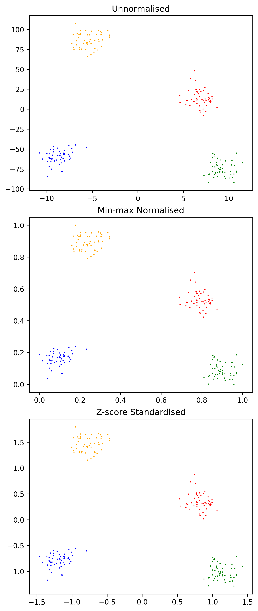
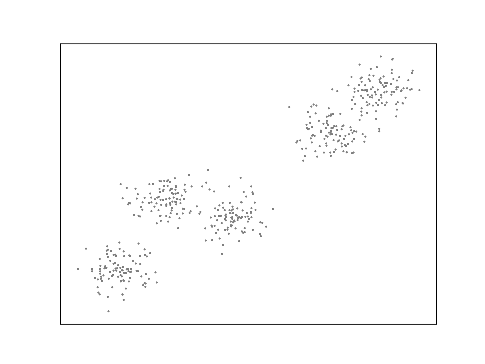
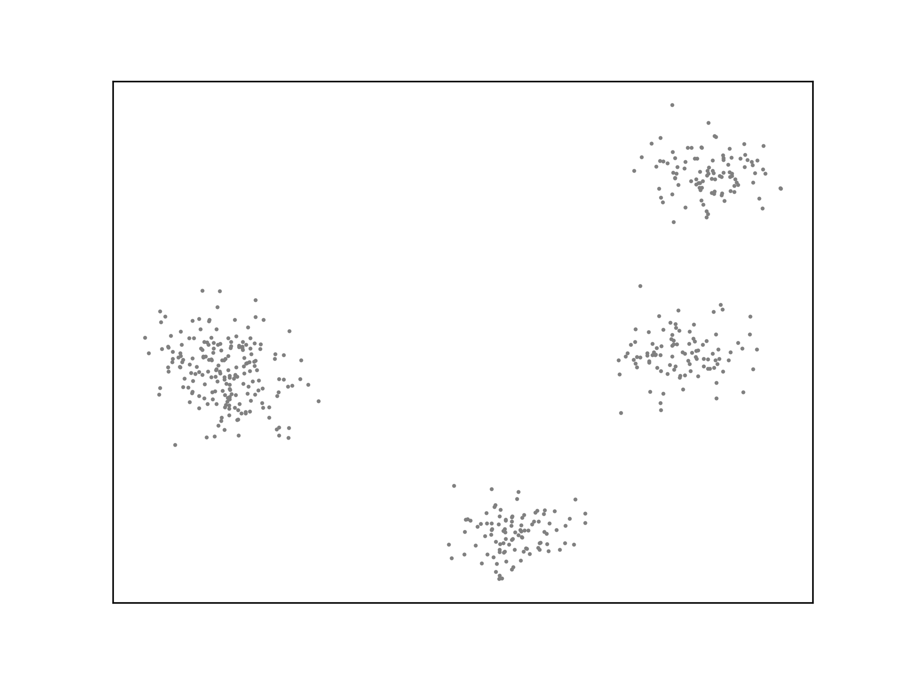

In supervised learning, each observation in the training set is an
$(\mathbf{x}, y)$ tuple, consisting of a input vector $\mathbf{x}$ and
an output label $y$. The goal is to learn a function $h(\mathbf{x})$
that approximates this relationship. This function should accurately
predict the output label of an unseen observation. If the labels form a
set of discrete values or classes, the problem is called classification.
If the labels are continuous, it is a regression problem.

Another type of problem consists of only feature vectors, without
labels. There are many scenarios where a labelled dataset cannot be
obtained for which this approach is appropriate.

```python
import matplotlib as mpl
import matplotlib.pyplot as plt
import matplotlib.animation as animation
from matplotlib.ticker import (MultipleLocator, AutoMinorLocator, FormatStrFormatter)
import numpy as np
import sklearn.datasets
import math
import random
%matplotlib inline

def new_plot():
    fig = plt.figure(dpi=300)
    ax = fig.add_subplot(1,1,1)
    ax.set_xticks([])
    ax.set_yticks([])
    ax.set_aspect('auto')
    return fig, ax
```

## Normalisation

Unsupervised learning algorithms draw upon the similarity of elements in
the training set to form predictions. The _distance metric_ is an
important part of doing so. In multidimensional problems, the magnitude
of different attributes can differ significantly, effectively weighting
the proximity in the dimension which has the largest average value more
heavily. Attributes should be normalised to preserve any existing
relationship, but scaling the underlying values to lie within a certain
range.

```python
def min_max_normalise_feature(x_min, x_max, x_i):
    return (x_i-x_min)/(x_max-x_min)
def z_score_standardise_feature(x_mean, x_std, x_i):
    return (x_i-x_mean)/x_std
```

The same dataset without normalisation, using min/max normalisation and
using z-score normalisation.

```python
fig = plt.figure(dpi=300, layout="constrained", figsize=(5,12))

colors = ["blue", "red", "green", "orange"]
X, y= sklearn.datasets.make_blobs(n_features=2, centers=4, n_samples=200)
X = np.stack((X[:,0], X[:,1]*10), axis=-1)

ax = fig.add_subplot(3,1,1)
ax.set_title("Unnormalised")
ax.scatter(X[:, 0], X[:, 1], marker=".", c=y, s=2, cmap=mpl.colors.ListedColormap(colors))

ax = fig.add_subplot(3,1,2)
ax.set_title("Min-max Normalised")
ax.scatter(min_max_normalise_feature(np.min(X[:, 0]), np.max(X[:, 0]), X[:, 0]), min_max_normalise_feature(np.min(X[:, 1]), np.max(X[:, 1]), X[:, 1]), marker=".", c=y, s=2, cmap=mpl.colors.ListedColormap(colors))

ax = fig.add_subplot(3,1,3)
ax.set_title("Z-score Standardised")
ax.scatter(z_score_standardise_feature(np.mean(X[:, 0]), np.std(X[:, 0]), X[:, 0]), z_score_standardise_feature(np.mean(X[:, 1]), np.std(X[:, 1]), X[:, 1]), marker=".", c=y, s=2, cmap=mpl.colors.ListedColormap(colors))


```



## Minkowski distance

If $X$ and $Y$ are vectors of size $n$, the Minkowski distance is defined
as:

$$D(X,Y) = (\sum_i^n|x_i-y_i|^p)^{\frac{1}{p}}$$

If $p$ is 1 the result is the Manhattan distance. If $p$ is 2 the result
is the Euclidean distance. As $p \rightarrow \infty$, $D(X,Y)$ is the
Chebyshev distance. This is a useful distance metric.

```python
def D(X,Y,p):
    return sum([abs(X[i] - Y[i])**p for i in range(len(X))])**(1/p)
```

For all distance functions, the distance from one point to another is
positive; the distance function is symmetric; the distance from a point
to itself is always 0 and the distance from one point to another is
always less than or equal to the distance between them via a third
(triangular).

## Partitional Clustering

Assigns $N$ observations into $K < N$ clusters, maximising
_intra-cluster similarity_ and minimising _inter-cluster_ similarity.

- $\mathbf{C}$ is a structure of $K$ clusters.
- $C \in \mathbf{C}$ is one of $K$ clusters.
- $e \in C$ is one observation within a cluster.
- $n_C$ is the number of examples in cluster C.
- $c_k \in C_k$ is the centroid of the $k$th cluster.

_Variability_ or _inertia_ of a cluster:

$$variability(C) = \sum_{e \in C}d(e, centroid(C))$$

The _centroid_ of a cluster is the average position of every element in
the cluster. $d$ is some distance function, often the square of the
euclidean distance.

Minimising the _dissimilarity_ of the cluster structure is an
optimisation problem. This is sometimes called the _within cluster sum
of squares_ (WCSS). Maximising the _between cluster sum of squares_.

$$dissimilarity(\mathbf{C}) = \sum_{C \in \mathbf{C}}variability(C)$$
$$\text{WCSS}(\mathbf{C}) = \sum_{C \in \mathbf{C}}\sum_{e \in C} d_{Euc}(e, centroid(C))^2$$

### K-Means

K-Means is a greedy iterative descent algorithm for minimising
dissimilarity.

Given a number of clusters $K$ and $N$ observations:

1. Select $K$ observations as centroids.
2. Repeat:
   1. Assign each observation to the cluster of the nearest centroid.
   2. Calculate the new centroid position for each cluster.

```python
def nearest_centroid(c_k, x):
    centroid_distances = [D(x, c_k[i], 2)**2 for i in range(len(c_k))]
    return centroid_distances.index(min(centroid_distances))


def k_means(c_k, X):
    C = [[] for _ in range(len(c_k))]
    for i in range(len(X)):
        centroid_distances = [D(X[i], c_k[j], 2)**2 for j in range(len(c_k))]
        # print(centroid_distances)
        C[centroid_distances.index(min(centroid_distances))].append(X[i])
    # return C
    return np.array([[np.mean(np.array(C[i])[:,j]) for j in range(len(X[0]))] for i in range(len(c_k))])
```

```python
colors = ["blue", "red", "orange", "green", "purple"]
X, y= sklearn.datasets.make_blobs(n_features=2, centers=5, n_samples=500)
X = np.stack((min_max_normalise_feature(np.min(X[:, 0]), np.max(X[:, 0]), X[:,0]), min_max_normalise_feature(np.min(X[:, 1]), np.max(X[:, 1]), X[:,1])), axis=-1)
c_k = np.array([X[random.randint(0,500)] for _ in range(5)])
```

```python
fig, ax = new_plot()
ax.scatter(X[:,0], X[:,1], s=1, c='grey')

def animate_k_means(frame):
    global c_k
    global ax
    ax.clear()
    ax.set_xticks([])
    ax.set_yticks([])
    if frame == 0:
        ax.scatter(X[:,0], X[:,1], s=1, c='grey')
    elif frame == 1:
        ax.scatter(X[:,0], X[:,1], s=1, c='grey')
        ax.scatter(c_k[:,0], c_k[:,1], c=[i for i in range(5)], s=10, marker='s', edgecolors="black", cmap=mpl.colors.ListedColormap(colors))
    elif frame == 2:
        ax.scatter(X[:,0], X[:,1], s=1, c=[nearest_centroid(c_k, x) for x in X], cmap=mpl.colors.ListedColormap(colors))
        ax.scatter(c_k[:,0], c_k[:,1], c=[i for i in range(5)], s=10, marker='s', edgecolors="black", cmap=mpl.colors.ListedColormap(colors))
    else:
        c_k = k_means(c_k, X)
        ax.scatter(X[:,0], X[:,1], s=1, c=[nearest_centroid(c_k, x) for x in X], cmap=mpl.colors.ListedColormap(colors))
        ax.scatter(c_k[:,0], c_k[:,1], c=[i for i in range(5)], s=10, marker='s', edgecolors="black", cmap=mpl.colors.ListedColormap(colors))

anim = animation.FuncAnimation(fig=fig, func=animate_k_means, frames=9, interval=1000)
anim.save('../animations/k_means.gif')
```



K-Means is not optimal. The algorithm may not generate ideal cluster centroids, as
is the case in the example below. Many strategies for evaluating
clustering algorithms and finding more optimal solutions exist.


